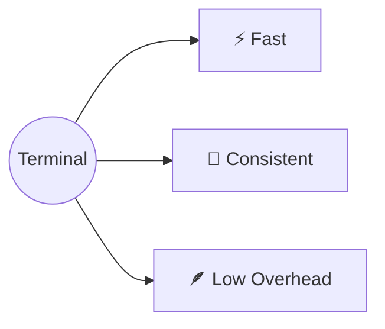

---
prev:
  text: '前言'
  link: '/preface'
next:
  text: '服务器'
  link: '/servers'
---

# 命令行 (Command Line)

> The fastest way to talk to computer

## Bash is all you need

<iframe width="560" height="315" src="https://www.youtube.com/embed/AEmHcFH1UgQ" frameborder="0" allowfullscreen></iframe>

## 终端与 Shell



### iTerm2

### Warp

## 基础导航与文件操作

常见命令：

- **`ls`** – list directory contents
- **`cd`** – change directory
- **`mkdir`** – make directory
- **`rmdir`** – remove directory
- **`cat`** – show file contents
- **`man`** – command manual
- **`less`** – show file contents by page
- **`touch`** – creates an empty file
- **`rm`** – remove file
- **`echo`** – repeat input

```bash
# 常用命令示例
cd /path/to/directory    # 切换目录
ls -la                   # 列出所有文件（含隐藏文件）
mkdir -p my/nested/dir   # 递归创建目录
rmdir empty-folder       # 删除空目录
touch newfile.txt        # 创建空文件
cat file.txt             # 查看文件内容
less largefile.log       # 分页查看文件内容
man ls                   # 查看 ls 命令手册
echo "hello world"       # 输出文本
rm -rf unwanted-folder   # 删除目录及其内容
```

## VIM 编辑器

掌握在服务器上编辑文件的核心工具 VIM，熟悉其三种基本模式：

- **普通模式** — 导航和命令（默认模式）
- **插入模式** — 编辑文本（按 `i` 进入）
- **命令模式** — 执行命令（按 `:` 进入）

常用操作：保存退出（`:wq`）、强制退出（`:q!`）、保存（`:w`）。

## 搜索与日志排查

学习使用以下工具进行文件搜索和日志查看：

| 命令 | 用途 |
|------|------|
| `find` | 按名称、类型、时间等查找文件 |
| `grep` | 在文件内容中搜索文本模式 |
| `tail` | 查看文件末尾内容（常用 `tail -f` 实时跟踪日志） |
| `cat` | 查看完整文件内容 |

```bash
# 搜索示例
find /var/log -name "*.log" -mtime -1    # 查找最近一天修改的日志
grep -r "error" /var/log/                 # 递归搜索包含 "error" 的日志
tail -f /var/log/syslog                   # 实时跟踪系统日志
```

## 任务调度

了解如何使用 Cron jobs 在特定的时间自动执行 Bash 脚本。

```bash
# Cron 表达式格式：分 时 日 月 周
# 每天凌晨 2 点执行备份脚本
0 2 * * * /home/user/backup.sh

# 每 5 分钟检查一次服务状态
*/5 * * * * /home/user/check-service.sh
```
