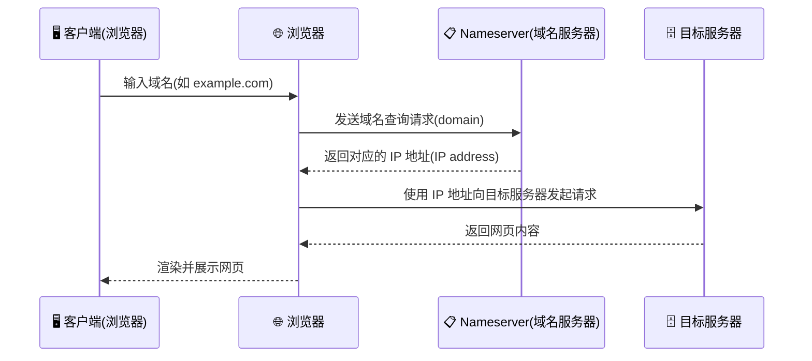

---
prev:
  text: '操作系统'
  link: '/operating-systems'
next:
  text: '安全'
  link: '/security'
---

# 网络知识 (Networking Knowledge)

## 互联网是如何工作的

一次网络请求从你的电脑到服务器，要经过多个节点（hop）：

```
  💻 Your Computer
       │
       ▼
  🔌 Network Card        网卡将数据转为电信号/无线信号
       │
       ▼
  📡 Router              路由器将数据包转发到外部网络
       │
       ▼
  🏢 ISP                 本地互联网服务提供商（如电信、联通）
       │
       ▼
  🌐 Tier 1 ISP ──────► 🌐 Tier 1 ISP ──────► 🏢 Datacenter
                 骨干网互联                          │
                                                   ▼
                                            🖥️ Server Cluster
                                                   │
                                                   ▼
                                            ⚖️ Load Balancer
                                                   │
                                                   ▼
                                            🖥️ Server
```

> 使用 `traceroute` 命令可以查看数据包经过的每一跳：`traceroute google.com`

## 术语

### 网络类型

| 术语 | 全称 | 说明 |
|------|------|------|
| 🌐 **Internet** | Internet | 网络的网络，全球互联的公共网络 |
| 🏢 **Intranet** | Intranet | 企业或组织内部的私有网络，外部无法访问 |
| 🏠 **LAN** | Local Area Network | 局域网，覆盖较小区域（家庭、办公室） |
| 🌍 **WAN** | Wide Area Network | 广域网，跨地域连接多个 LAN |

### IP 协议与地址

- **IP**（Internet Protocol）— 互联网协议，定义数据包如何在网络中寻址和路由
- **IP Address** — 分配给联网设备的数字标签，是设备在网络中的唯一标识

| 版本 | 格式 | 示例 |
|------|------|------|
| **IPv4** | 4 组十进制数（32 位） | `8.8.8.8` |
| **IPv6** | 8 组十六进制数（128 位） | `2001:4860:4860:8888` |

> IPv4 地址已基本耗尽（约 43 亿个），IPv6 提供近乎无限的地址空间。

## 网络工具

常用的网络诊断命令：

- **Check status of a network host** — 检测目标主机是否可达及延迟

  ```bash
  ping google.com
  ```

- **Follow the path of your request** — 追踪数据包到达目标的每一跳

  ```bash
  traceroute google.com
  ```

- **Show network status** — 查看当前系统的网络连接和监听端口

  ```bash
  netstat -lt | less
  ```

> `ping` 用于快速检测连通性，`traceroute` 用于定位网络瓶颈，`netstat` 用于排查端口占用问题。

## 网络协议基础

核心术语：

| 术语 | 全称 | 说明 |
|------|------|------|
| **TCP** | Transmission Control Protocol | 传输控制协议，可靠、有序的数据传输 |
| **UDP** | User Datagram Protocol | 用户数据报协议，快速但不保证可靠性 |
| **ICMP** | Internet Control Message Protocol | 网络控制报文协议，用于 `ping`、`traceroute` 等诊断 |
| **Packet** | — | 数据包，网络传输的基本数据单元 |

TCP vs UDP：

| 特性 | TCP | UDP |
|------|-----|-----|
| 连接方式 | 需要三次握手 | 无连接 |
| 可靠性 | 可靠，保证数据到达 | 不可靠，可能丢包 |
| 速度 | 较慢 | 较快 |
| 适用场景 | Web 请求、文件传输 | 视频流、游戏、DNS |

## TCP vs UDP 通信

```
  TCP 握手                         UDP
┌─────────────────────────┐   ┌─────────────────────────┐
│                         │   │                         │
│  Sender      Receiver   │   │  Sender      Receiver   │
│  💻  ──SYN──►   🖥️       │   │  💻  ◄─REQUEST─  🖥️      │
│  💻  ◄─SYN ACK─ 🖥️       │   │  💻  ─RESPONSE─► 🖥️      │
│  💻  ──ACK──►   🖥️       │   │  💻  ─RESPONSE─► 🖥️      │
│                         │   │  💻  ─RESPONSE─►  🖥️     │
└─────────────────────────┘   └─────────────────────────┘
```

**TCP 三次握手**：通信前必须先建立连接

1. **SYN** — 客户端发起连接请求
2. **SYN ACK** — 服务器确认并回应
3. **ACK** — 客户端确认，连接建立，开始传输数据

**UDP 通信**：无需握手，直接发送

- Sender 直接向 Receiver 发送数据，不等待确认
- 速度快但可能丢包，适合实时性要求高的场景（直播、游戏）

## DNS & URLs

### 术语

**DNS**（Domain Name System） - 域名系统，将人类可读的域名（如 `example.com`）转换为计算机可识别的 IP 地址（如 `93.184.216.34`）。

**Nameserver**（域名服务器） - 持有 DNS 记录的服务器，负责将域名翻译为 IP 地址。

**A Record**（Address Record） - 将域名直接映射到一个 IPv4 地址。例如 `example.com → 93.184.216.34`。是最基础、最常用的 DNS 记录类型。

**CNAME**（Canonical Name Record） - 将一个域名指向另一个域名（别名），而非直接指向 IP。例如 `www.example.com → example.com`。常用于为同一服务设置多个域名入口，最终由目标域名的 A Record 解析出 IP 地址。

### URL 到 IP 的解析过程



### 相关网络工具

#### nslookup

`nslookup` 用于查询 DNS 记录，可以查看域名对应的 A Record（IP 地址）或 CNAME（别名）。

```bash
# 查询域名的 A Record（默认查询）
nslookup example.com

# 输出示例：
# Name:    example.com
# Address: 93.184.216.34    ← 这就是 A Record

# 指定查询 CNAME 记录
nslookup -type=cname www.example.com

# 输出示例：
# www.example.com  canonical name = example.com  ← 这就是 CNAME
```

#### dig

`dig` 是更强大的 DNS 查询工具，能返回详细的 DNS 解析信息，包括 TTL、权威服务器等。

```bash
# 查询 A Record
dig example.com

# 输出中关键部分：
# ;; ANSWER SECTION:
# example.com.        3600    IN    A    93.184.216.34

# 查询 CNAME 记录
dig www.example.com CNAME

# 输出中关键部分：
# ;; ANSWER SECTION:
# www.example.com.    3600    IN    CNAME    example.com.

# 精简输出（只看结果）
dig +short example.com
# 93.184.216.34
```

#### nslookup vs dig

| 特性 | nslookup | dig |
|------|----------|-----|
| 输出详细程度 | 简洁，适合快速查询 | 详细，包含 TTL、权威服务器等 |
| 查询 A Record | `nslookup example.com` | `dig example.com A` |
| 查询 CNAME | `nslookup -type=cname domain` | `dig domain CNAME` |
| 适用场景 | 日常快速排查 | 深入分析 DNS 问题 |

两个工具本质上都是向 Nameserver 发送 DNS 查询请求，返回的结果就是 A Record、CNAME 等 DNS 记录。它们是查看和调试 DNS 记录最常用的命令行工具。

### URL 解剖

**URL**（Uniform Resource Locator） - 统一资源定位符，用于标识互联网上资源的地址。

以 `blog.yourdomain.com/en/fullstack?test=true` 为例：

```
blog.yourdomain.com/en/fullstack?test=true
├──┘ ├────────┘ ├─┘├───────────┘ ├────────┘
│    │          │   │             └─ query parameter（查询参数）
│    │          │   └─ path（路径）
│    │          └─ tld（顶级域名）
│    └─ domain（域名）
└─ subdomain（子域名）
```

| 部分 | 示例 | 说明 |
|------|------|------|
| **subdomain**（子域名） | `blog` | 域名的前缀，用于区分同一域名下的不同服务（如 `blog`、`api`、`www`） |
| **domain**（域名） | `yourdomain` | 网站的核心标识名称，需要购买注册 |
| **tld**（顶级域名） | `.com` | Top-Level Domain，由域名管理机构分配（如 `.com`、`.org`、`.cn`） |
| **path**（路径） | `/en/fullstack` | 指向服务器上具体资源的路径 |
| **query parameter**（查询参数） | `?test=true` | 以 `?` 开头，用 `key=value` 形式传递额外参数，多个参数用 `&` 连接 |
