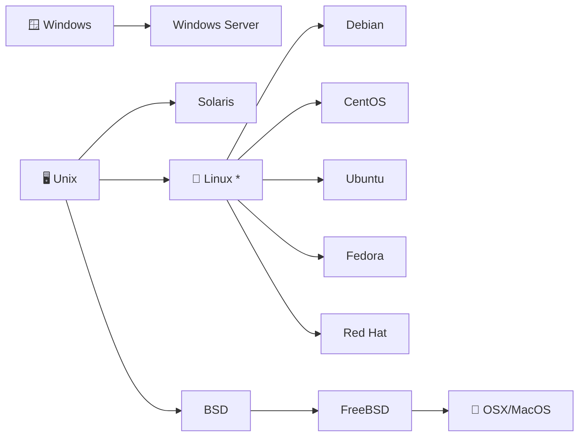

---
prev:
  text: '服务器'
  link: '/servers'
next:
  text: '网络知识'
  link: '/networking'
---

# 操作系统 (Operating Systems)

## 操作系统的种类



## 操作系统分层

```
┌─────────────────────────────────┐
│           👤 User               │·········  用户通过应用程序与系统交互
│  ┌───────────────────────────┐  │
│  │         🐚 Shell          │  │·········  命令解释器，连接用户与内核
│  │  ┌─────────────────────┐  │  │
│  │  │      ⚙️ Kernel      │  │  │·········  操作系统核心，管理资源与进程
│  │  │  ┌───────────────┐  │  │  │
│  │  │  │  🖥️ Hardware  │  │  │  │·········  CPU、内存、磁盘、网卡等物理设备
│  │  │  └───────────────┘  │  │  │
│  │  └─────────────────────┘  │  │
│  └───────────────────────────┘  │
└─────────────────────────────────┘
```

## Unix 系统的美学设计

> In Unix, everything is either a **file** or a **process**.

```
                    ┌─────────────────┐
                    │   Unix System   │
                    └────────┬────────┘
              ┌──────────────┴──────────────┐
              ▼                             ▼
     ┌────────────────┐            ┌────────────────┐
     │  📄 File       │            │  ⚙️ Process     │
     │  (静态数据)     │            │  (运行中的程序)   │
     └───────┬────────┘            └───────┬────────┘
             │                             │
  ┌──────────┼──────────┐       ┌──────────┼──────────┐
  │          │          │       │          │          │
  ▼          ▼          ▼       ▼          ▼          ▼
  普通文件   目录     设备文件   前台进程  后台进程     守护进程
  .txt     /home    /dev/sda   vim      &jobs       sshd
```

- **文件（File）**：Unix 将几乎一切抽象为文件 — 普通文件、目录、设备（`/dev`）、管道、Socket 都是文件
- **进程（Process）**：正在运行的程序实例，拥有 PID、内存空间和文件描述符

```bash
# 查看文件
ls -la /dev              # 设备也是文件
file /bin/ls             # 查看文件类型

# 查看进程
ps aux                   # 列出所有进程
top                      # 实时监控进程
kill -9 <PID>            # 终止进程
```

## 用户与权限管理

学习创建新用户，并将其添加到 `sudo` 组以获取管理员权限。掌握如何修改文件和目录的所有权及权限。

```bash
# 用户管理
sudo adduser newuser              # 创建新用户
sudo usermod -aG sudo newuser     # 添加到 sudo 组

# 权限管理
chmod 700 ~/.ssh                  # 设置 SSH 目录权限
chown -R user:group /var/www      # 修改目录所有者
```

::: tip 安全提示
将 SSH 密钥权限设置为 `700` 保护安全，防止其他用户访问。
:::

## 进程控制

了解如何查看当前运行的进程，并使用 `kill` 命令停止不需要或卡死的进程。

```bash
ps aux                    # 查看所有运行中的进程
ps aux | grep node        # 查找 Node.js 进程
kill <PID>                # 正常终止进程
kill -9 <PID>             # 强制终止进程
top                       # 实时查看系统资源使用
htop                      # 更友好的进程管理器
```
