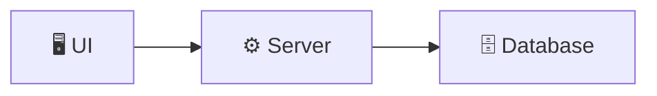
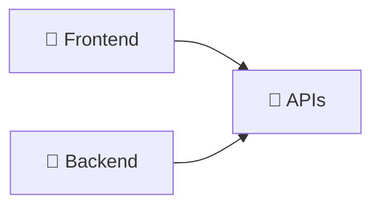

# 前言

> 我们不是要成为 全栈每个领域的专家，我们是要掌握如何把这些领域的核心知识串联起来。

## 前置知识

- 了解 编程
- 了解 Terminal（终端）的基本概念
- 有一张 信用卡（用于购买云服务器）

## 现代全栈计算

### UI

- 浏览器
- 移动设备
- 汽车
- 桌面电脑
- 电视
- 家电

### Server

- 接口 APIs
- 审计日志 Logging
- 用户认证 Authentication
- 开发平台

### Database

- 结构化数据
- 数据分析

## 前后端

