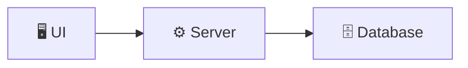
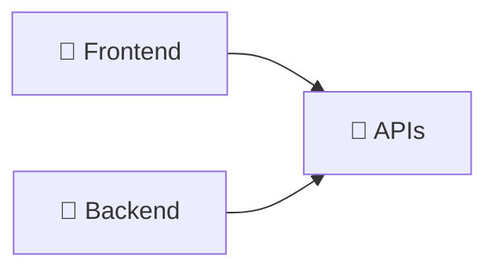
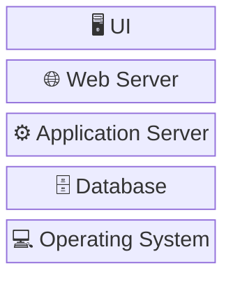
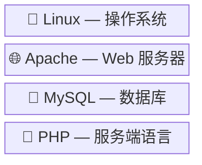
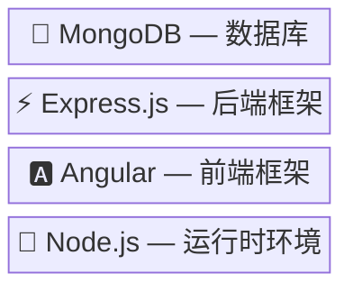
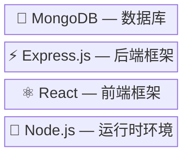
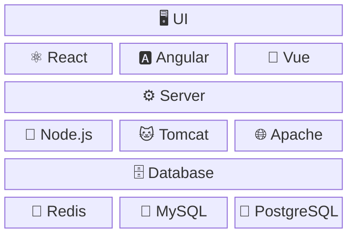

# 前言

## 前置知识（Prerequisites）

- 了解基础编程概念（变量、函数、控制流）
- 了解终端（Terminal）的基本概念
- 有一张信用卡（用于购买云服务器）

## 学习目标（Learning Objectives）

- 深入理解服务器（Server）与网络（Networking）的工作原理
- 掌握数据库（Database）的基本概念与使用
- 理解互联网（Internet）的通信机制
- 理解全栈系统各层之间的协作关系

## 现代全栈架构（Modern Fullstack Architecture）

### 用户界面层（UI Layer）

- 浏览器（Browser）
- 移动设备（Mobile）
- 车载系统（Automotive）
- 桌面客户端（Desktop）
- 智能电视（Smart TV）
- 智能家电（IoT Appliances）

### 服务端层（Server Layer）

- 应用程序接口（APIs）
- 日志与监控（Logging & Monitoring）
- 身份认证与授权（Authentication & Authorization）
- 开发与部署平台（Development Platform）

### 数据层（Database Layer）

- 结构化数据存储（Structured Data Storage）
- 数据分析与查询（Data Analytics & Querying）

### 前端与后端（Frontend & Backend）

## 什么是全栈工程师

> 无需成为 全栈每个领域的专家，我们是要掌握如何把这些领域的核心知识串联起来。

一个能创建和管理前端和后端系统的开发者，能够理解和处理从用户界面到数据库的整个技术栈的开发者。

### 什么是 栈

### LAMP 栈

### MEAN 栈

### MERN 栈

### 现代全栈

