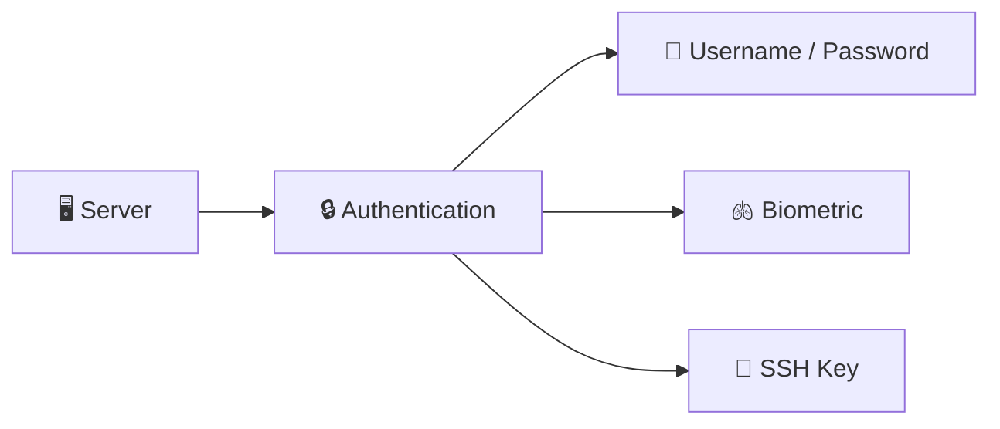

---
prev:
  text: '网络知识'
  link: '/networking'
next:
  text: '持续集成'
  link: '/ci'
---

# 安全 (Security)

## 安全类型

服务器的身份验证（Authentication）主要有三种方式：



| 类型 | 说明 |
|------|------|
| 🔐 Username / Password | 最基础的认证方式，易被暴力破解，建议配合强密码策略 |
| 🫁 Biometric（生物识别） | 指纹、面部识别等，常用于个人设备，服务器较少使用 |
| 🔑 SSH Key | 公钥/私钥对认证，安全性高，是服务器登录的推荐方式 |

> 生产环境中推荐使用 **SSH Key** 认证，并禁用密码登录。

### 密码暴力破解时间参考

密码越长、字符种类越多，被破解的时间越长：

| 密码长度 | 仅大小写字母 (a-Z) | 大小写+数字+符号 (0-9 a-Z %$!) |
|:--------:|:------------------:|:------------------------------:|
| 6 | instant | 20 seconds |
| 7 | instant | 49 minutes |
| 8 | 13 minutes | 5 days |
| 9 | 6 hours | 2 years |
| 10 | 6 days | 330 years |
| 11 | 138 days | 50 thousand years |
| 12 | 20 years | 8 million years |

> 建议密码至少 **12 位**，包含大小写字母、数字和特殊符号。

## Hashing

哈希函数将任意长度的输入转换为固定长度的字符串（哈希值），且**不可逆**。

```
  INPUT  +  hash function  =  hash
```

常见哈希算法对比（以 `./foo` 为输入）：

| 输入 | 算法 | 哈希值 |
|:----:|:----:|:------:|
| `./foo` | MD5 | `286755fad04869ca523320acce0dc6a4` |
| `./foo` | SHA1 | `c8fed00eb2e87f1cee8e90ebbe870c190ac3848c` |
| `./foo` | SHA256 | `6b3a55e0261b0304143f805a24924d0c1c44524821305f31d9277843b8a10f4e` |

特点：

- **单向性**：无法从哈希值反推原始数据
- **确定性**：相同输入永远产生相同输出
- **雪崩效应**：输入微小变化，输出完全不同
- **固定长度**：无论输入多大，输出长度固定

> ⚠️ MD5 和 SHA1 已不安全，推荐使用 **SHA256** 或更强的算法。密码存储推荐使用 **bcrypt**。

### 使用 OpenSSL 生成哈希

`openssl` 是系统自带的加密工具，可以直接在命令行生成哈希值：

```bash
# 查看 openssl 手册
man openssl

# 使用 MD5 计算哈希（awk 提取哈希值）
echo -n "foo" | openssl md5 | awk '{print $2}'
# 输出: acbd18db4cc2f85cedef654fccc4a4d8

# 使用 SHA1 计算哈希
echo -n "foo" | openssl sha1 | awk '{print $2}'

# 使用 SHA256 计算哈希（推荐）
echo -n "foo" | openssl sha256 | awk '{print $2}'
```

> `echo -n` 避免末尾换行符影响哈希结果。`awk '{print $2}'` 用于去掉前缀只保留哈希值。

## Hashing + Salt

## SSH 安全访问

### What is SSH

SSH（Secure Shell）通过**非对称加密**实现安全通信，核心是一对密钥：

```
  💻 Your Computer                              🖥️ Server
┌──────────────────┐                      ┌──────────────────┐
│                  │   encrypted messages  │                  │
│  🔐 Private Key  │  ◄════════════════►  │  🔓 Public Key   │
│    (secret)      │                      │                  │
│                  │                      │                  │
└──────────────────┘                      └──────────────────┘
```

工作原理：

1. `ssh-keygen` 生成一对密钥：**私钥**（留在本地，绝对保密）和**公钥**（放到服务器）
2. 连接时，服务器用公钥加密一段随机数据发送给你
3. 你的电脑用私钥解密并返回，服务器验证通过即允许登录
4. 之后所有通信都通过加密通道传输

> 🔑 私钥 = 你家钥匙（不能给别人），公钥 = 门锁（可以装在任何服务器上）

使用 `ssh-keygen` 生成公钥和私钥对，配置免密登录，并禁用 root 用户的直接登录以防止暴力破解。

```bash
# 生成 SSH 密钥对
ssh-keygen -t ed25519 -C "your_email@example.com"

# 将公钥复制到服务器
ssh-copy-id user@server_ip

# 禁用 root 登录（编辑 /etc/ssh/sshd_config）
PermitRootLogin no
PasswordAuthentication no
```

### Server Login

登录服务器的常用方式：

```bash
# 1. 使用密码登录服务器
ssh root@<your_IP>

# 2. 使用私钥登录服务器（指定密钥文件）
ssh -i ~/.ssh/alexfan root@<your_IP>

# 3. 退出服务器
exit
```

> `-i` 参数指定使用哪个私钥文件进行身份验证，适用于拥有多个密钥的场景。

### SSH Key Chain

每次登录都输入私钥路径很麻烦，可以用 macOS 的 Keychain 管理 SSH 密钥：

```bash
# 1. 确保 keychain 配置生效
vi ~/.ssh/config
```

在 `~/.ssh/config` 中添加：

```
Host *
  AddKeysToAgent yes
  UseKeychain yes
  IdentityFile ~/.ssh/alexfan
```

```bash
# 2. 将私钥添加到 keychain
ssh-add --apple-use-keychain alexfan
```

> 配置完成后，SSH 会自动从 Keychain 读取密钥，无需每次手动指定 `-i` 参数。
